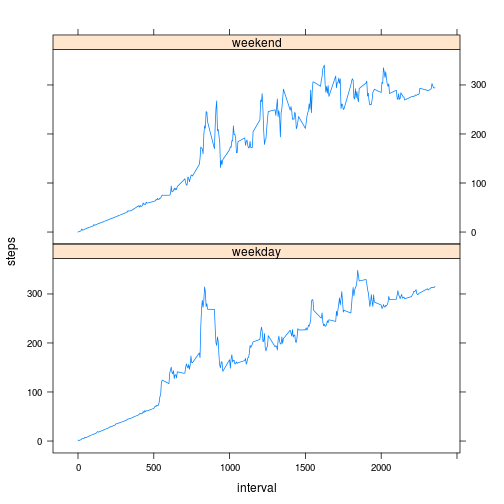

## Loading and preprocessing the data


```r
rm(list=ls())
setwd('/home/andrew/Documents/Dropbox/Coursera/reproducible research/RepData_PeerAssessment1/')
dataSet <- read.csv("activity.csv",header=TRUE,sep=",")
cleanData <- dataSet[which(dataSet$steps!= "NA"), ] 
```
## What is mean total number of steps taken per day?

```r
library(plyr)
dailySteps <- ddply(cleanData, .(date), summarise, steps=sum(steps))
hist(dailySteps$steps, main = "Total Steps Each Day", xlab="Steps per day")
```

 

```r
# Mean daily steps
mean(dailySteps$steps, na.rm=TRUE)
```

```
## [1] 10766.19
```

```r
# Median daily steps
median(dailySteps$steps, na.rm=TRUE)
```

```
## [1] 10765
```

## What is the average daily activity pattern?

```r
averageDaily <- ddply(cleanData, .(interval), summarise, steps=mean(steps))
plot(averageDaily$interval, averageDaily$steps, type="l", xlab="5 minute interval", 
ylab="Average steps",main="Average Daily Activity (all days)")
```

 

```r
# Maximum nupers of steps (per 5 minute interval), across all days: 

averageDaily$interval[max(averageDaily$steps)]
```

```
## [1] 1705
```
## Imputing missing values

```r
#  Number of missing values
sum(is.na(dataSet$steps))
```

```
## [1] 2304
```

```r
# Replacing NA's with 5-min interval average
newSet <- arrange(join(dataSet, averageDaily), interval)
```

```
## Joining by: steps, interval
```

```r
# Merging new dataset 
newSet$steps[is.na(newSet$steps)] <- newSet$interval[is.na(newSet$steps)]

averageDaily <- ddply(newSet, .(date), summarise, steps=sum(steps))
hist(averageDaily$steps, main="Number of Steps", 
     xlab="steps taken each day",,)
```

 

```r
# Mean steps of new data set:
mean(newSet$steps)
```

```
## [1] 186.9062
```

```r
# Median steps of new data set:
median(newSet$steps)
```

```
## [1] 0
```

## Are there differences in activity patterns between weekdays and weekends?


```r
library(lattice)
weekdays <- weekdays(as.Date(newSet$date))
dataWeekdays <- transform(newSet, day=weekdays)
dataWeekdays$wk <- ifelse(dataWeekdays$day %in% c("Saturday", "Sunday"),"weekend", "weekday")
averageWeek <- ddply(dataWeekdays, .(interval, wk), summarise, steps=mean(steps))

xyplot(steps ~ interval | wk, data = averageWeek, layout = c(1, 2), type="l")
```

 

